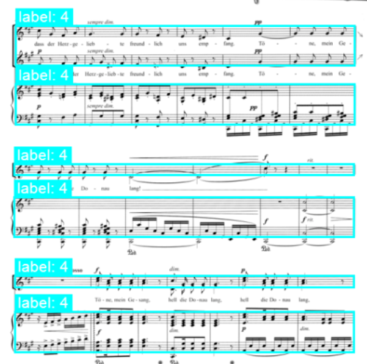
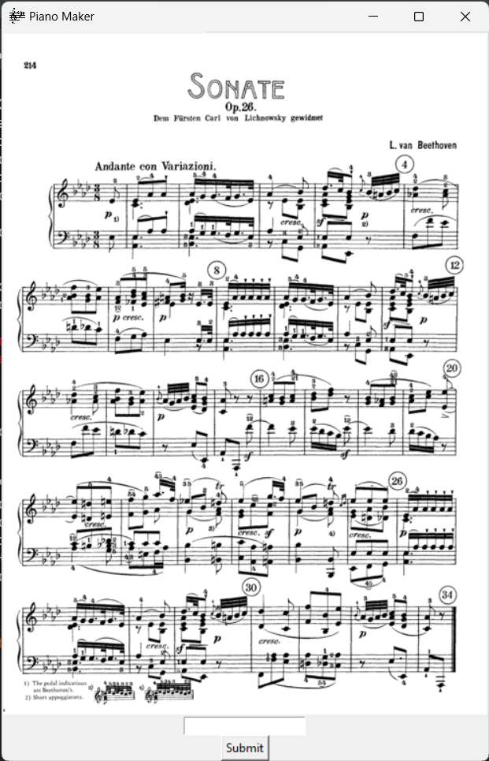

# Analysis of music notation documents using the YOLO system

:warning: **WIP**

## About this project

Optical Music Recognition (OMR) is a task that aims to automatically recognize the musical content of a document from a photo or scan of music notation for further processing (search, printing, editing, musicological analysis). For processing existing archival materials in libraries, however, it is first necessary to distinguish whether a given page contains musical notation, or what kind of notation (modern, mensural, choral, printed, written). At the moment, the best recognition models work at the level of individual lines of notation, so it is also necessary to identify individual lines during the analysis of a document so that the music can be well processed by the recognition models.

The aim of this project is to create a music notation page analyzer that will serve as a first stage in the automatic recognition of music notation pages. The analysis will be designed as an image object detection task, where the main goal will be to train (retrain) the state of the art model YOLOv8. The focus of the work lies in the preparation of the training data, as it will be necessary to harmonize a number of existing datasets into a unified format with the possible inclusion of synthetic data. At the same time, it will be necessary to decide what parameters of musical notation to analyse - a compromise must be found between what we need to know and what we are able to learn from the available datasets.

## Setup

```
# create new virtual environment
python -m venv /path/
# activate the environment
source /path/bin/activate
# install required modules from requirements.txt
pip install -r requirements.txt
```

## Main App

Given paths to datasets which can be both provided by default
or added by user creates a file system for training the YOLOv8 model,
including config `.yaml` file.

### Options

- `-c COUNT, --count COUNT`
    - How many files from each dataset will be processed. Default is all.
- `--split SPLIT`
  - Train test split ratio.
- `-l [LABELS ...], --labels [LABELS ...]`
  - List of labels to process: `0 : system_measures, 1 : stave_measures, 2 : staves, 3 : systems, 4 : grand staff`.
- `--deduplicate`
  - Checks for possible duplicates in labels and removes them. May affect performance.
- `--tag`
  - Tags generated files with dataset nickname. Example: `"al2_filename"`.
  - Default is all.
- `--stad [STAD ...]`
  - Paths to standard COCO dataset to be processed.
- `--al2`, `--mpp`, etc.
  - Includes the dataset into final dataset.
  - These are loaded automatically from their respective classes.
  - The selection can be expanded by user, for that see [this](#work-with-other-datasets-than-those-provided-by-default).

## Example usage
```
python3 -m app ../Test --split 0.8 --al2 --mpp --stad my_standard_dataset -l 0 2
```

This will take records from the `AudioLabs v2`, `Muscima++` and user specified standard dataset
and divide them in the ratio of `0.8`, using only labels `0` and `2`. I will create this file structure:

```
Test
├─ images
│  ├─ train
│  ├─ val
├─ labels
│  ├─ train
│  ├─ val
├─ config.yaml
```

If the `--split` option is not used the file structure looks like this:

```
Test
├─ images
├─ labels
├─ config.yaml
```
  
## PianoMaker

Is a small app that allow other labels to be added into an already existing dataset.
It is mainly ment to be used to add `grand_staff` labels.
The dataset is loaded using methods defined in classes derived from `Dataset_OMR`,
then a file with additional labels in loaded and when completed the final product
is saved to the beforehand specified output path.

### Usage

```
# to run the script
python3 -m app.PianoMaker dataset_path additional_labels_path output_path --dataset_format
```

````
usage: OMR Dataset Utils [-h] [-v] [-o OFFSET] [-l GRAND_LIMIT] [--al2] [--mpp] [--stand]
                         dataset_path piano_path output_path

Given a dataset and a file with additional labels makes a JSON combining both current dataset labels and the new ones.

positional arguments:
  dataset_path          Path to dataset to be processed.
  piano_path            Path to grand staff annotations.
  output_path           Path to store the final dataset at.

options:
  -h, --help            show this help message and exit
  -v, --verbose         Make script verbose.
  -o OFFSET, --offset OFFSET
                        How far apart two coordinates can be to still be considered the same, in pixels. Default is
                        10.
  -l GRAND_LIMIT, --grand_limit GRAND_LIMIT
                        Minimal amount of staves to consider multiple staves linked together to be a grand staff.
                        Default is 1.
  --al2                 The AudioLabs_v2 dataset will be processed.
  --mpp                 The Muscima++ dataset will be processed.
  --stand               The Standard Dataset dataset will be processed.
````

### Additional labels format

At this point in time only `grand_staff` addition is supported
(`systems` can be derived from already existing labels in AudioLabs v2 and Muscima++ datasets).
Let's say we want to add `grand_staff` for this image:



Its record in a file would look like this:

```
file_name
2-2 1-2 1-2
```

Where a numeral means how many staves there are in a grand staff
and `a-b-c-...-x` means that all these grand staves and inside one system.

:warning: Even if you don't consider single (or any other count) staff as a grand staff,
make sure to include it in a description, the script counts through all staves in the given picture
from top to bottom and not including some staves will mess up the process.
Minimal number of staves for it to be considered can be specified before running the script using the `-l` flag. 


## PianoAnnotator

Is a small, simple and most-of-the-time-working annotation app built
to make annotating existing datasets easier.



### Usage

Type in annotation in desired format and hit `enter` or `Submit`.

```
python3 -m app.PianoMaker.PianoAnnotator output_path dataset_path --dataset_format 
```

## Work with other datasets than those provided by default

Create a new class derived from `Dataset_OMR` and implement necessary methods
to fit your dataset format:

```python
class MyDataset(Dataset_OMR):
    name = "My Dataset"
    nickname = "mydat"

    # necessary
    def _get_coco_format(self, record: dict) -> list[int]:
        """
        Given a single record from loaded JSON returns label in COCO format.
        """
    
    # optional
    def _download_proc(self, download_path: Path):
        """
        Downloads dataset to given path.
        """
        
    # optional
    def process_image(self, img_path: Path, output_path: Path):
        """
        Given a path to an image this method loads it,
        does all necessary preprocessing and saves it to given `output_path`.
        """
```

Dataset classes are loaded automatically - you only need to import it to
`Datasets/Import.py`

```python
# Datasets/Import.py
from .DatasetOMR import Dataset_OMR
...
from .MyDatset import MyDataset
```

## References

Images displayed are the part of the AudioLabs v2 dataset accompanying the following paper:

```
Frank Zalkow, Angel Villar Corrales, TJ Tsai, Vlora Arifi-Müller, and Meinard Müller
Tools for Semi-Automatic Bounding Box Annotation of Musical Measures in Sheet Music
In Demos and Late Breaking News of the International Society for Music Information Retrieval Conference (ISMIR), 2019.
```
