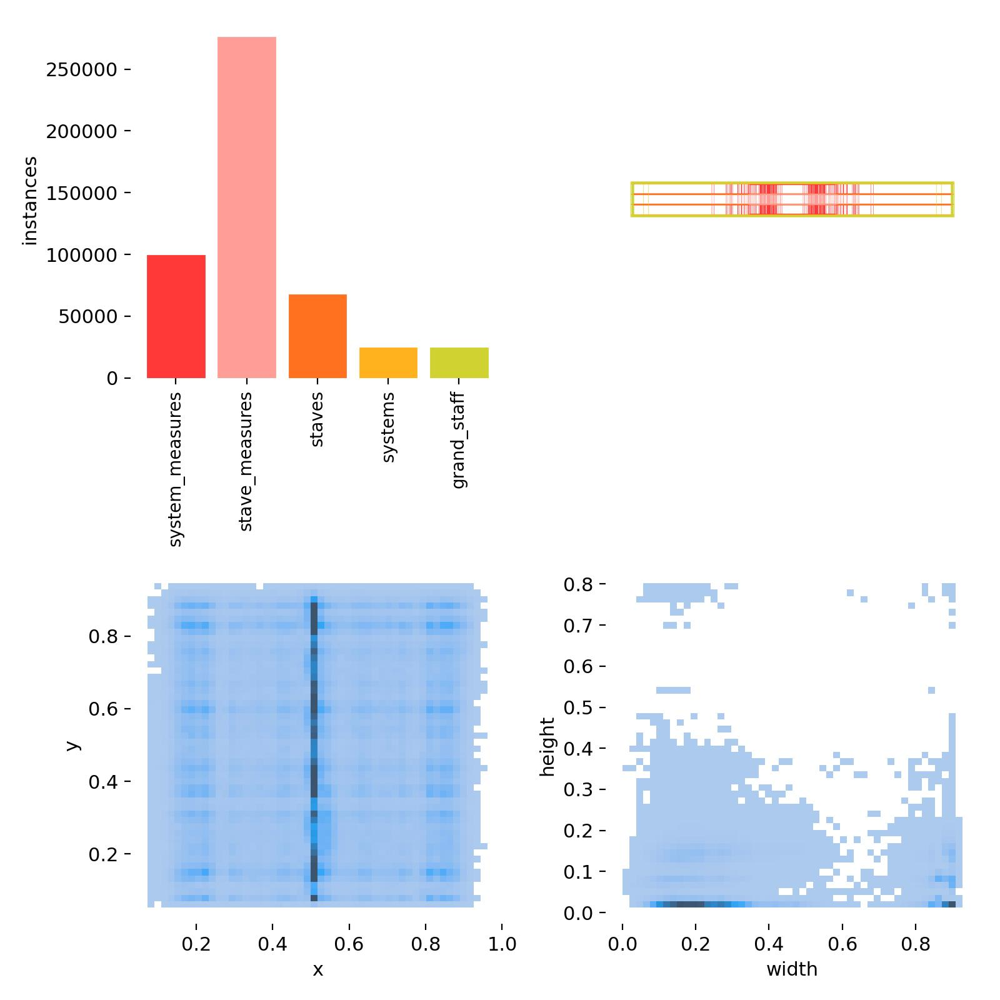
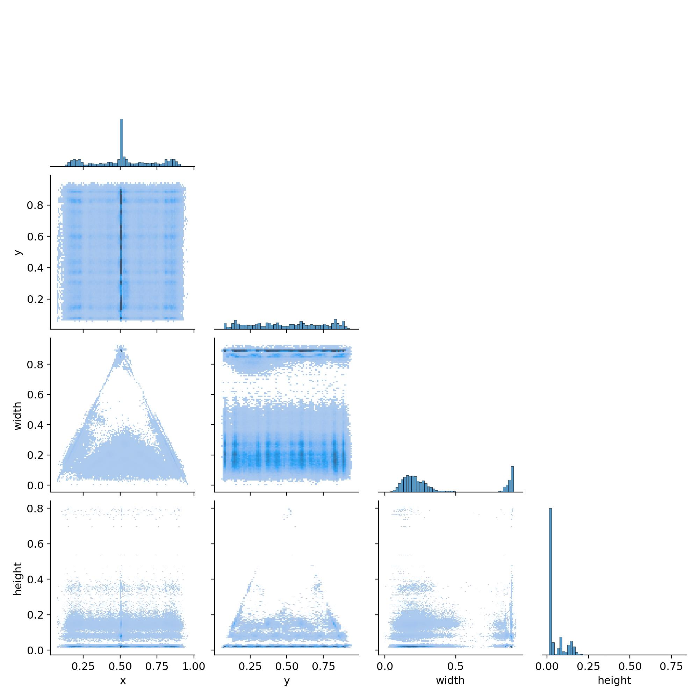

# Analysis of music notation documents using the YOLO system

This repository contains multiple tools for OMR dataset processing, new dataset that is a combination of AudioLabs v2, Muscima++ and OSLiC, and a pretrained YOLOv8 for music notation recognition.
In the final dataset, there are 7013 images (from which around 1000 are negative samples/background, without any music in them) that contain almost half a million bounding boxes -
99102 system measures,
275548 staff measures,
67064 staves,
23851 systems,
23428 grand staves.

Semester work at MFF CUNI under the guidance of Jirka Mayer.

## Quick start

### For getting started see [user documentation](docs/README.md)

### [Download the latest dataset](http://www.ms.mff.cuni.cz/~dvoravo/omr_datasets/) (~600 MB)

## Tools

In addition to this dataset, multiple tools are provided

- [`MZK scraper`](https://github.com/v-dvorak/mzkscraper), that was developed along this project

[](https://github.com/v-dvorak/mzkscraper)

- [`PianoMaker`](app/PianoMaker/README.md) and `PianoAnnotator`, a small app that allows staff system and grand staff labels to be added into an already existing dataset

## Dataset overview





## Formal project specification

Version in Czech is [here](docs/project_specification.pdf).

Optical Music Recognition (OMR) is a task that aims to automatically recognize the musical content of a document from a photo or scan of music notation for further processing (search, printing, editing, musicological analysis). For processing existing archival materials in libraries, however, it is first necessary to distinguish whether a given page contains musical notation, or what kind of notation (modern, mensural, choral, printed, written). At the moment, the best recognition models work at the level of individual lines of notation, so it is also necessary to identify individual lines during the analysis of a document so that the music can be well processed by the recognition models.

The goal of this project is to create a music notation page analyzer that will serve as a first stage in the automatic recognition of music notation pages. The analysis will be designed as an image object detection task, where the main goal will be to train (retrain) the state-of-the-art model YOLOv8. The focus of the work lies in the preparation of the training data, as it will be necessary to harmonize a number of existing datasets into a unified format with the possible inclusion of synthetic data. At the same time, it will be necessary to decide what parameters of musical notation to analyse - a compromise must be found between what we need to know and what we are able to learn from the available datasets.

## Acknowledgements

- ### Staves and staff systems extraction from SVG

  - by @Kristyna-Harvanova , the project can be found [here](https://github.com/Kristyna-Harvanova/Bachelor-Thesis)

- ### Grand staff extraction from SVG

  - by @Jirka-Mayer , the project can be found [here](https://github.com/ufal/olimpic-icdar24)

## References

### AudioLabs v2

```
Frank Zalkow, Angel Villar Corrales, TJ Tsai, Vlora Arifi-Müller, and Meinard Müller
Tools for Semi-Automatic Bounding Box Annotation of Musical Measures in Sheet Music
In Demos and Late Breaking News of the International Society for Music Information Retrieval Conference (ISMIR), 2019.
```

### Muscima++

[GitHub](https://github.com/OMR-Research/muscima-pp)

```
Jan Hajič jr., Pavel Pecina. In Search of a Dataset for Handwritten Optical Music Recognition: Introducing MUSCIMA++. CoRR, arXiv:1703.04824, 2017. https://arxiv.org/abs/1703.04824.

Alicia Fornés, Anjan Dutta, Albert Gordo, Josep Lladós. CVC-MUSCIMA: A Ground-truth of Handwritten Music Score Images for Writer Identification and Staff Removal. International Journal on Document Analysis and Recognition, Volume 15, Issue 3, pp 243-251, 2012. (DOI: 10.1007/s10032-011-0168-2).
```

### OSLiC

[GitHub](https://github.com/OpenScore/Lieder?tab=readme-ov-file)

```
Gotham, M. R. H.; and Jonas, P. The OpenScore Lieder Corpus. In Münnich, S.; and Rizo, D., editor(s), Music Encoding Conference Proceedings 2021, pages 131–136, 2022. Humanities Commons. Best Poster Award. https://doi.org/10.17613/1my2-dm23
```

## Known issues

### Wrong annotations in Muscima++ derivatives

Muscima++ takes empty staves as valid staves, we only consider staves with some music to be valid, this lead to multiple problems while working with M++ - empty staves are marked as valid. This has to be fixed mostly manually.

System are mainly created by looking at system staves at approximately the same height that are than connected to one (system) bounding box. Because M++ is handwritten, not all system measures end at the end of their respectable staves, this leads to a creation of systems, that may exclude a part of stave, that in reality is a part of the system. I'm working on this.