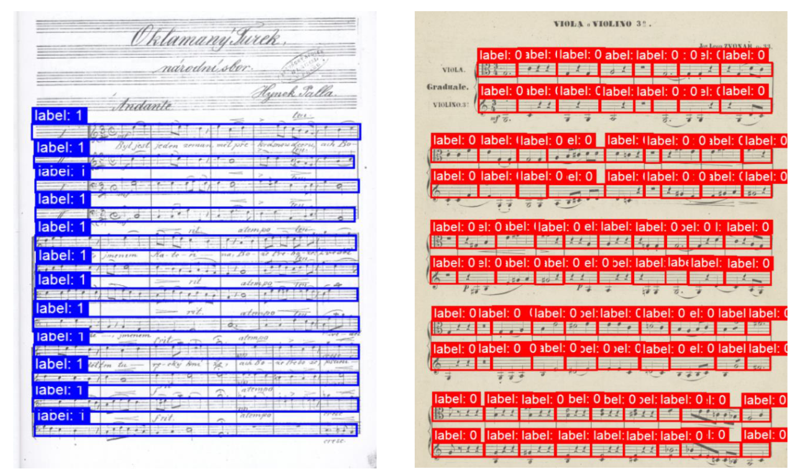

# Analysis of music notation documents using the YOLO system

This repository contains multiple tools for OMR dataset processing, the goal is to create a new dataset by combining AudioLabs v2, Muscima++, OSLiC and a custom dataset MZKBlank, that can be converted to multiple formats. The goal is to train the state-of-the-art models from YOLO on this dataset.

In the final dataset, there are 7013 images that contain almost half a million bounding boxes for staffs, staff measures, grand staffs, systems and system measures.

Semester work at MFF CUNI under the guidance of Jirka Mayer.



## Quick start

- [User documentation](docs/README.md)
- [Download the latest dataset](https://github.com/v-dvorak/omr-layout-analysis/tree/datasets-release) (~2.5 GB)
- [Download the latest model](https://github.com/v-dvorak/omr-layout-analysis/releases) (~50 MB)
- [MZKBlank dataset](app/MZKBlank/README.md)
- [Experiment results](https://github.com/v-dvorak/omr-layout-analysis/tree/evaluation-release)

## Dataset overview

|| images | system measures | stave measures | staves | systems | grand staves |
|-|-:|-:|-:|-:|-:|-:|
| AudioLabs v2 | 940 | 24 186 | 50 064 | 11 143 | 5 376 | 5 375 |
| Muscima++ | 140 | 2 888 | 4 616 | 883 | 484 | 94 |
| OSLiC | 4 927 | 72 028 | 220 868 | 55 038 | 17 991 | 17 959 |
| MZKBlank | 1 006 | 0 | 0 | 0 | 0 | 0 |
| **total** | 7 013 | 99 102 | 275 548 | 67 064 | 23 851 | 23 428 |

### AudioLabs v2

AudioLabs v2 is an extension of the AudioLabs v1 dataset, its annotations were generated with the help of a neural network and the original dataset, the images are generated from CSV files. Grand staves and system bounding boxes were added manually to the dataset.

### Muscima++

MUSCIMA++ is a dataset of handwritten music notation for musical symbol detection that is based on the MUSCIMA dataset. Grand staves and system bounding boxes were added manually to the dataset.

### Open Score Lieder - OSLiC

Collection of songs by 19th century composers in MuseScore format with associated data. The annotations were parsed from CSVs that were generated along with PNGs using the MuseScore app from dataset's MSCX scores.

Because of many inconsistencies, some scores were ruled out of the final dataset, despite all this these are a pixel-accurate annotations.

### MZKBlank

For best training results 1-10\% of images in the dataset should be background images (negative samples), unfortunately the datasets mentioned above do not contain enough of these examples.

[Moravská Zemská Knihovna](https://www.digitalniknihovna.cz/mzk/) (MZK) offers access to more than two thousand public domain sheet music documents with over nine thousand labeled pages that do not contain any music (`blank`, `front_cover`, `front_end_sheet`, `title_page`, `table_of_contents` and more) - our negative samples.

MZKBlank contains 1 006 semi-randomly chosen images that are related to sheet music but do not contain any sheet music. The numbers of representatives of one label are relative to the total number of pages.

## Acknowledgements

- [Staves and staff systems extraction from SVG](https://github.com/Kristyna-Harvanova/Bachelor-Thesis), [Kristyna Harvanova](https://github.com/Kristyna-Harvanova)
- [Grand staff extraction from SVG](https://github.com/ufal/olimpic-icdar24), [Jirka Mayer](https://github.com/Jirka-Mayer)

## References

### AudioLabs v2

```
Frank Zalkow, Angel Villar Corrales, TJ Tsai, Vlora Arifi-Müller, and Meinard Müller
Tools for Semi-Automatic Bounding Box Annotation of Musical Measures in Sheet Music
In Demos and Late Breaking News of the International Society for Music Information Retrieval Conference (ISMIR), 2019.
```

### Muscima++

[GitHub](https://github.com/OMR-Research/muscima-pp)

```
Jan Hajič jr., Pavel Pecina. In Search of a Dataset for Handwritten Optical Music Recognition: Introducing MUSCIMA++. CoRR, arXiv:1703.04824, 2017. https://arxiv.org/abs/1703.04824.

Alicia Fornés, Anjan Dutta, Albert Gordo, Josep Lladós. CVC-MUSCIMA: A Ground-truth of Handwritten Music Score Images for Writer Identification and Staff Removal. International Journal on Document Analysis and Recognition, Volume 15, Issue 3, pp 243-251, 2012. (DOI: 10.1007/s10032-011-0168-2).
```

### OSLiC

[GitHub](https://github.com/OpenScore/Lieder?tab=readme-ov-file)

```
Gotham, M. R. H.; and Jonas, P. The OpenScore Lieder Corpus. In Münnich, S.; and Rizo, D., editor(s), Music Encoding Conference Proceedings 2021, pages 131–136, 2022. Humanities Commons. Best Poster Award. https://doi.org/10.17613/1my2-dm23
```

## Known issues

### Wrong annotations in Muscima++ derivatives

Muscima++ takes empty staves as valid staves, we only consider staves with some music to be valid, this lead to multiple problems while working with M++ - empty staves are marked as valid. This has to be fixed mostly manually.

System are mainly created by looking at system staves at approximately the same height that are than connected to one (system) bounding box. Because M++ is handwritten, not all system measures end at the end of their respectable staves, this leads to a creation of systems, that may exclude a part of stave, that in reality is a part of the system.
